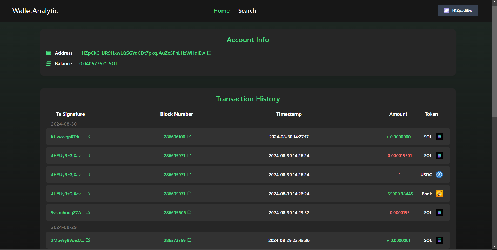

# Solana Wallet Analytic App

This project is an app for Solana users to analyze their previous wallet transactions by simply connecting their wallet to the app.



Check out the deployed app: [https://wallet-analytics.vercel.app/](https://wallet-analytics.vercel.app/)

## Instalation

First, clone the repo:
```
git clone https://github.com/Noobmaster169/wallet-analytics
cd wallet-analytics
```

Then install the dependencies
```
npm install
```

Finally, run the development server:

```bash
npm run dev
# or
yarn dev
# or
pnpm dev
# or
bun dev
```

Open [http://localhost:3000](http://localhost:3000) with your browser to see the result.